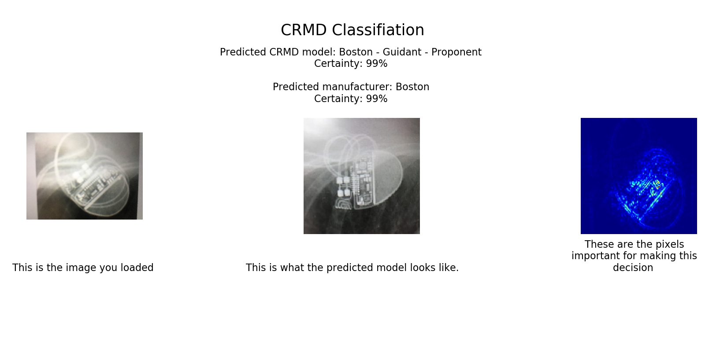

# CRMD-classifier

Predicting cardiac rhythm management devices (CRMDs) manufacturers using deep learning

## Scripts:
Data processing:

* number_of_models - plots bar chart of number of each class in test and train data.
* mean_image - takes the mean of images within given folder.
* std_image - takes the SD of images within given folder.
* data_preprocessing - applies histogram equalisation to images.
* image_resizing - resizes images in given path to 227x227
* image_to_numpy - creates numpy arrays of data with size 150x150 or 227x227.

Model building:

* first model - builds and trains simple model.
* first_model_binary - builds and trains binary classification model.
* export_features - runs images through convolutional base and saves output
* load_features - takes output from export features and trains classifier
* InceptionV3_scratch - trains model with InceptionV3 architecture - not initialise on ImageNet.
* scratch_hyperas - building a model from scratch using hyper wrapper for grid search.
* conv_base_frozen - transfer learning using ImageNet weights.
* fine_tuning_final_run - similar to conv_base frozen, but fine tunes top layers.
* fold_creator - splits data into 10 folds for cross validation
* fold_directory - trains model with fine-tuning and cross-validation.

Data analysis:

* plot_tensorboard - takes tensor board training traces and plots using plotly.
* predicting_confusion - plots confusion matrices of predictions on test set.

Final programme:

* CRMD_predictor - makes a prediction of CRMD model on images stored in images_to_run folder.